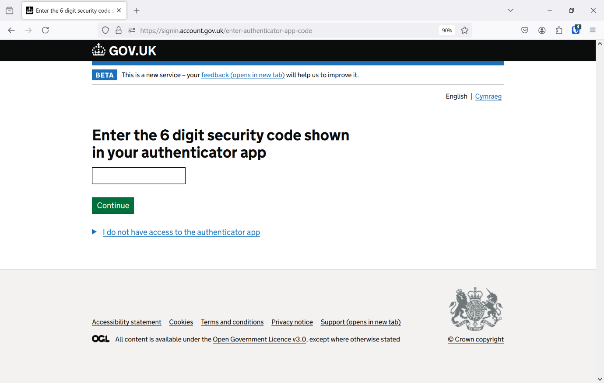

---
geometry:
- margin=20mm
---

# Update your capital schemes 

Welcome to the Update your capital schemes user guide. This guide covers how to register an account for the service and sign in. 

## Create a GOV.UK One Login account 

1. Go to the service website: [https://update-your-capital-schemes.activetravelengland.gov.uk/](https://update-your-capital-schemes.activetravelengland.gov.uk/) 

1. Click the “Start now” button:

    

1. Click “Create your GOV.UK One Login” button to create an account: 

    

1. Provide the email address you want to use for the GOV.UK One Login service to connect to the service. Please use your work email address. 

    

1. Check your email for a 6-digit security code. Copy and paste it into the form and click “Continue”.

    

1. Create a password for your GOV.UK One Login account: 

    

1. Choose how you wish to get two factor authentication security codes. You can either provide a phone number to get codes via text or use an authenticator application / password manager. We recommend using an authenticator application. 

    

1. Open the authenticator app on your device and scan the QR code and provide the generated 6-digit code: 

    

1. Optionally, if you are using a password manager or web authenticator application you can click the “I cannot scan the QR code” link to show a secret key that you can copy and paste into an authenticator app. This will allow the app to generate the required security code. 

    

1. You have now created your GOV.UK One Login account. Click “Continue” to be redirected back to the service. 

    

1. After being redirected to the service you will see a Forbidden page. Please email [update-your-capital-schemes@activetravelengland.gov.uk](mailto:update-your-capital-schemes@activetravelengland.gov.uk) with the email you registered with GOV.UK One Login to be provided access. 

    

## Sign in to the service 

1. Create a GOV.UK One Login account if you haven’t already (as described in the previous section) 

1. Go to the service: [https://update-your-capital-schemes.activetravelengland.gov.uk/](https://update-your-capital-schemes.activetravelengland.gov.uk/) 

1. Click the “Start now” button: 

    

1. Click the “Sign In” button to sign in with your GOV.UK One Login account: 

    

1. Enter the email address you registered with GOV.UK One Login: 

    

1. Enter your GOV.UK One Login account password: 

    

1. Enter your security code sent to either your phone number or displayed on your registered authenticator app as “GOV.UK One Login”: 

    

1. If you’ve logged in successfully, you’ll be redirected back to the service and will be able to see your capital schemes. 

## Using the service to update your capital schemes 

The below section outlines how you can use the service to view and update your capital schemes. All data displayed is example data. 

1. After successfully logging in you will view the schemes page. This shows all the active and incomplete ATF schemes in your authority that you can provide updates on. Schemes are displayed in a table with each row representing a single scheme showing the unique reference, funding programme, name and date of the last review. If the scheme was last reviewed prior to the current quarterly monitoring window a Needs review tag will appear. The page may also show a notification banner, this will either display: the number of days left in a quarterly monitoring window if you have outstanding schemes that need a review; or an overdue message if you have schemes that need a review and you are outside of the quarterly monitoring window month (quarterly monitoring window months are January, April, July, October). 

    To view a scheme in more detail you can click the scheme reference. 

    

1. After clicking a scheme reference you will visit the scheme page for the selected scheme. This contains more details about the selected scheme separated into separate cards: Overview, Funding, Milestones, Outputs (full page shown below). Changes can be made to spend to date and milestones by clicking the Change links alongside these items. This will take you to forms shown in the following sections. 
   
    If the scheme has not been reviewed in the current quarterly monitoring window a message will appear at the top of the schemes page saying the scheme needs a review. 

    

    

    

    
 
1. The change spend to date form allows you to provide updates to the reported spend of ATF funds for a scheme. You can change the value in the form and click confirm to make a change. The form will validate the data you provide to ensure the data is a valid number, is not negative, is equal or less than the schemes funding allocation. At present commas separating thousands are not supported.

    Clicking confirm will submit the update and if valid return you to the scheme page. 

    
 
1. The change milestones form allows you to make changes to planned and actual milestone dates associated with the scheme. Once you have made changes to milestone dates you can click confirm to update those dates and return to the scheme page. The form validates that the date you have entered is a valid date. At this time, you are unable to remove a milestone date, therefore where a date is present it can only be changed not removed. 

    

    

1. To confirm that you have reviewed the data shown on the scheme page and that it is up-to-date you can use the checkbox at the bottom of the scheme page. Select this checkbox and click confirm to update ATE records that the scheme is up-to-date. After clicking confirm you will be returned to the schemes page and shown a success notification. The Needs review tag will disappear from the scheme on the schemes page table. 

    

    

## Get support for the service 

To request support for the service, email [update-your-capital-schemes@activetravelengland.gov.uk](mailto:update-your-capital-schemes@activetravelengland.gov.uk). 
